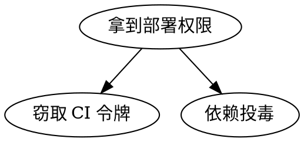

# STRIDE 与攻击树细则（threat-model/references/stride-and-attack-tree.md）

主文件第 4–6 节的完整定义、提问提示与模板。

## STRIDE 六问定义

| 类别 | 全称 | 要问的问题 | 常见进入路径 |
|---|---|---|---|
| S | Spoofing 仿冒 | 谁能冒充合法主体（用户/服务/包）？ | 无签名的 API、可伪造的 token、未校验的域名 |
| T | Tampering 篡改 | 谁能改数据/代码/配置且不被发现？ | 明文传输、无完整性校验的缓存、可写的配置文件 |
| R | Repudiation 抵赖 | 出事后能否证明"谁做了什么"？ | 无审计日志、日志可被同级权限删除 |
| I | Information disclosure 信息泄露 | 谁能看到不该看的数据？ | 日志打印密钥、越权接口、错误信息回显 |
| D | Denial of service 拒绝服务 | 谁能让服务/流程不可用？ | 无界队列、无超时的外部调用、资源未限流 |
| E | Elevation of privilege 提权 | 谁能获得超出设计的权限？ | 越权参数、默认高权限账号、可注入的配置 |

判据：一格允许填"不适用（原因）"，但**原因必须与资产属性相关**（如"静态文档无写入通道 → T 不适用"），"感觉没事"不是原因。

## 信任边界四类

1. **进程内**：同进程代码之间——默认互信，除非有插件/动态加载；
2. **进程间**：IPC/HTTP/RPC/消息队列——每次跨越都要问"谁在另一边、凭证是什么"；
3. **系统边界**：本机文件系统、内核、环境变量、容器运行时；
4. **外部**：第三方 API、用户输入、上游仓库/镜像——最高危，所有外部输入默认按数据处理（见 `prompt-injection-review` 三问）。

## 攻击树画法

- 根 = 攻击目标（"拿到 X 的写权限"），叶 = 前置条件（"服务未鉴权"）。
- 每片叶标验证方式：一条能证明该前提成立/不成立的命令；验证不了的写"未验证假设"。
- 缩进文本树示例：

```text
拿到部署权限
├─ 或：窃取 CI 令牌
│   ├─ 前提：仓库有明文 .env（验证：git grep -n 'TOKEN' -- '.env*'）
│   └─ 前提：workflow 用 pull_request_target + secrets（验证：git grep -n 'pull_request_target' -- '.github/workflows/**'）
└─ 或：依赖投毒
    ├─ 前提：安装脚本放行（验证：npm view <包> scripts --json）
    └─ 前提：action 未 pin SHA（验证：git grep -nE 'uses: [A-Za-z0-9_.-]+/[A-Za-z0-9_.-]+@v[0-9]' -- '.github/workflows/**'）
```

`dot` 版同构（`.dot` 源文件与 `dot -Tpng` 渲染图都进评审材料）：



## 缓解落地模板

| 方向 | 模板写法 |
|---|---|
| 消除 | "该路径随设计改动消失：<设计变更>；验收：<命令> 证明路径不复存在" |
| 转移 | "交给 <现有防护>；验收：<防护的配置/文档位置>" |
| 缓解 | "在 <边界> 增加 <校验>；验收：<绕过尝试被拦截的命令>" |
| 接受 | "接受原因：<理由>；残余风险：<描述>；评审人：<名字>" |

## 交付物模板

```markdown
# <组件> 威胁模型
对象：<仓库> @ <提交哈希>（固定于 2026-xx-xx）
范围：<diff 或模块列表>
## 信任边界
（文字或图；每个资产标边界类）
## 资产清单
| 资产 | 类（数据/代码/通道/宿主） | 边界 |
## STRIDE 表
（主文件第 4 节的表）
## 攻击树（可选）
## 缓解清单
| 威胁 | 方向（消除/转移/缓解/接受） | 落地 | 验收命令 |
```

